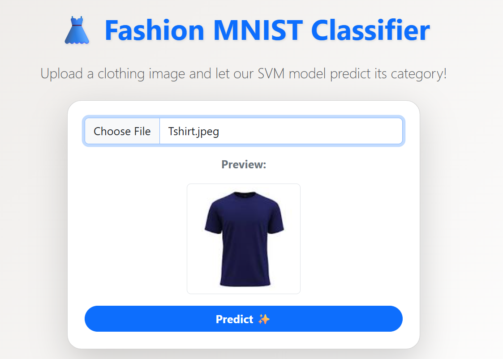
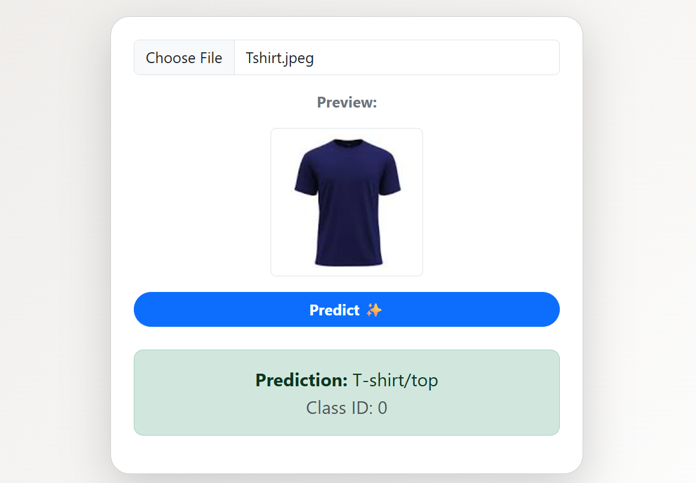

# 🧥👟 Fashion MNIST Classifier (Flask Web App)

This project is a **Flask-based web application** that uses a **trained SVM model** on the [Fashion MNIST dataset](https://github.com/zalandoresearch/fashion-mnist) to classify fashion items such as T-shirts, trousers, dresses, sneakers, and more.  

The app allows users to **upload their own fashion images**, preview them, and get predictions instantly.

---

## 🚀 Features
- Trained **SVM model** with ~88% accuracy on test data  
- Upload custom images (`.jpg` / `.jpeg` / `.png`)  
- **Image preview** before prediction  
- Displays predicted class with confidence  
- Responsive and appealing **CSS interface**  

---

## 📂 Project Structure
```plaintext
FashionMnistClassifier/
├── app.py                # Flask backend
├── requirements.txt      # Python dependencies
├── svm_model.pkl         # Trained model (tracked with Git LFS)
├── templates/
│   └── index.html        # Frontend HTML
├── static/
│   └── style.css         # CSS styles
```

---


## 🌐 Deployment

This app is deployed on **Render**.  

🔗 **Live Demo:** [https://fashionmnistclassifier.onrender.com/](https://fashionmnistclassifier.onrender.com/)

---

## 🖼️ Screenshots 

| Upload Page | Prediction Result |
|-------------|------------------|
|  |  |

---

## 📊 Model Details
- **Dataset:** Fashion MNIST (60,000 train, 10,000 test images, 28×28 grayscale)  
- **Model Used:** Support Vector Machine (SVM)  
- **Accuracy on Test Data:** ~88%  
- **Accuracy on Custom User Images:** ~60% (depends on background & preprocessing)  

---

## 📡 API Endpoints

### 1. Home
**`GET /`**  
- Renders the upload form (HTML page).  

### 2. Predict
**`POST /predict`**  
- Accepts an uploaded image file.  
- Returns JSON with predicted class and its numeric ID.

---

## 👩‍💻 Author
**Azmeen Khatoon**  
B.Tech AIML | IGDTUW  

---
